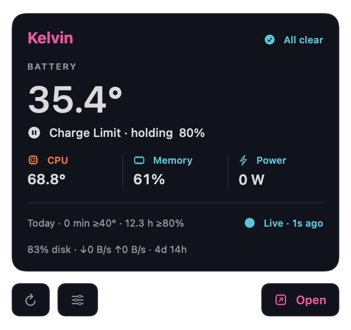
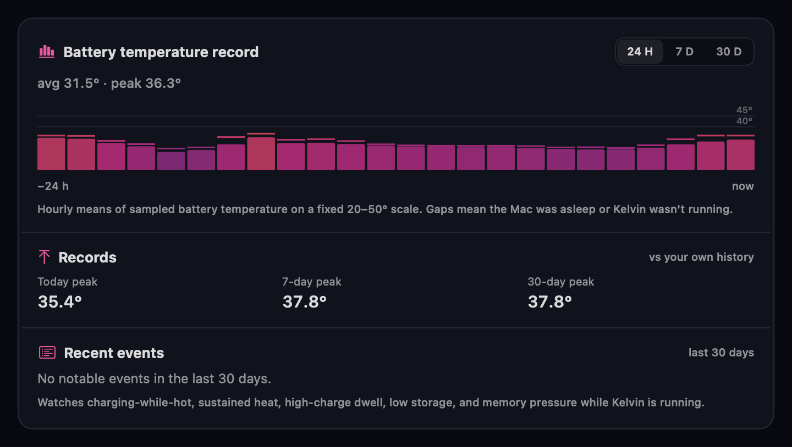

<!-- ===================== HEADER ===================== -->


<div align="center">


<p>
  
  <a href="https://github.com/jeasop0301?tab=followers"></a>
  <a href="https://github.com/jeasop0301?tab=repositories"></a>
</p>

</div>

<!-- ===================== ABOUT ===================== -->
##  &nbsp;소개 · About

Apple 플랫폼(**macOS · iOS**)과 저지연 시스템/네트워킹을 만드는 인디 개발자입니다.
**Swift**로 맥·아이폰 앱을, **Rust**로 성능이 중요한 부분을 씁니다.

```yaml
name:      jeasop0301
builds:    menu-bar apps · CLI tools · low-latency streaming
languages: [ Swift, Rust, TypeScript, C ]
values:    [ honest-by-design, local-first, privacy, small-sharp-tools ]
motto:     "Unmeasured is absent, never a fabricated zero."
```

<!-- ===================== TECH ===================== -->
##  &nbsp;기술 스택 · Tech Stack

<p>
  
  
  
  
</p>
<p>
  
  
  
  
</p>
<p>
  
  
  
  
</p>

<!-- ===================== PROJECTS ===================== -->
##  &nbsp;프로젝트 · Featured

### 🌡️ [Kelvin](https://github.com/jeasop0301/thermomole) &nbsp; 

Apple Silicon 맥용 **메뉴바 온도·배터리·메모리 모니터**. 맥을 열화상 카메라처럼 읽고, 계정·원격 텔레메트리·조작된 숫자 없이 정직한 가이드를 줍니다. `kelvin status / history / coach` CLI 포함.

<div align="center">
  
  &nbsp;
  
</div>

### 🎮 [betterparsec](https://github.com/jeasop0301/betterparsec) &nbsp;

Parsec을 대체하는 **초저지연 원격 데스크톱/게임 스트리밍 스택**. WebRTC 전송, Sunshine/Moonlight 호환, 커스텀 저비트레이트 프로토콜과 FEC 프레이밍.

### 📶 [CelRoute](https://github.com/jeasop0301/celroute-support) &nbsp; 

iPhone의 셀룰러 연결로 Mac의 트래픽을 라우팅하는 **테더링 앱**(iPhone + Mac). 개인정보를 로컬에 두는 설계.

<!-- ===================== STATS ===================== -->
##  &nbsp;GitHub Analytics

<div align="center">


</div>

<!-- ===================== CONTACT ===================== -->
##  &nbsp;연락 · Contact

<p>
  <a href="mailto:jeasop0301@gmail.com"></a>
  <a href="https://github.com/jeasop0301"></a>
</p>

<!-- ===================== FOOTER ===================== -->

